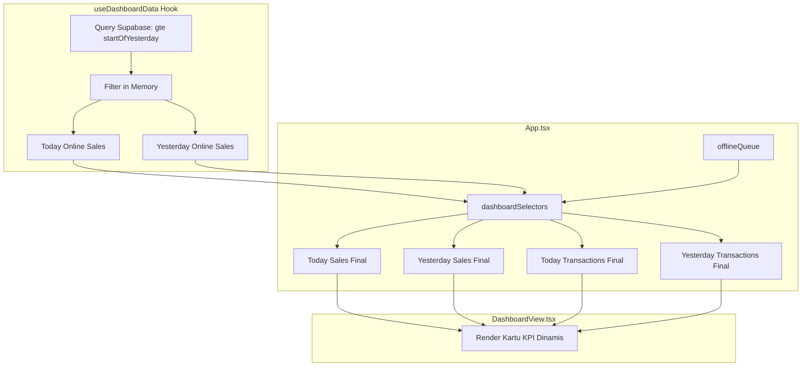

# Spesifikasi Desain: Kalkulasi Pertumbuhan KPI Dashboard Dinamis Berdasarkan Data Historis

Dokumen ini mendefinisikan arsitektur dan spesifikasi teknis untuk mengkalkulasi persentase pertumbuhan pendapatan harian dan selisih total transaksi secara dinamis berdasarkan data transaksi historis riil (Supabase & local IndexedDB), menggantikan data fiktif/hardcoded pada dashboard.

## Analisis Masalah & Kebutuhan
Saat ini, kartu KPI pada dashboard Fenina Salon & Reflexology menampilkan keterangan growth berikut:
1. **Pendapatan Hari Ini**: Menampilkan teks hardcoded `+12.5% dari kemarin`.
2. **Total Transaksi**: Menampilkan teks `+{queueCount} transaksi` (yang didasarkan pada jumlah antrean offline saat ini, bukan perbandingan dengan kemarin).

Kebutuhan pengguna adalah agar keterangan pertumbuhan ini dihitung secara dinamis dengan membandingkan data hari ini (Today) dengan data kemarin (Yesterday) secara riil dan akurat.

## Solusi Teknis
Untuk meminimalisir overhead jaringan, kita akan memperluas query transaksi saat ini agar mengambil data 2 hari terakhir (Hari ini & Kemarin) dalam satu kali request ke Supabase, kemudian memilah data tersebut di memori berdasarkan rentang waktu di zona waktu Asia/Jakarta.

### 1. Rentang Waktu (Asia/Jakarta)
* **Hari Ini**: `created_at >= startOfDay` (di mana `startOfDay` dimulai dari `00:00:00+07:00` hari ini).
* **Kemarin**: `created_at >= startOfYesterday` dan `created_at < startOfDay` (di mana `startOfYesterday` dimulai dari `00:00:00+07:00` kemarin).

### 2. Integrasi Offline/PWA
Transaksi offline lokal yang disimpan dalam `OFFLINE_MUTATION_QUEUE` juga dipisahkan berdasarkan properti `created_at`-nya ke dalam akumulasi hari ini atau kemarin sebelum digabungkan dengan data dari server.

### 3. Rumus Perhitungan
* **Persentase Pertumbuhan Pendapatan (Revenue Growth)**:
  * Jika Pendapatan Kemarin > 0: `((HariIni - Kemarin) / Kemarin) * 100`
  * Jika Pendapatan Kemarin = 0 dan Hari Ini > 0: `+100%`
  * Jika Pendapatan Kemarin = 0 dan Hari Ini = 0: `+0%`
* **Selisih Jumlah Transaksi (Transaction Count Growth)**:
  * Selisih = `TransaksiHariIni - TransaksiKemarin`
  * Jika Selisih >= 0: Menampilkan `+Selisih kemarin` (misal: `+2 kemarin`)
  * Jika Selisih < 0: Menampilkan `Selisih kemarin` (misal: `-1 kemarin`)

---

## Rencana Perubahan Kode

### Component & Hook Flow

### [useDashboardData.ts](file:///c:/Claude-Cowork/02_Projects/System%20POS/src/hooks/useDashboardData.ts)
* Tambahkan helper `getAsiaJakartaYesterdayStart`.
* Ubah `.gte('created_at', startOfDay)` menjadi `.gte('created_at', startOfYesterday)`.
* Filter data online ke `todayTxs` dan `yesterdayTxs`.
* Return `yesterdayCount` dan `yesterdaySum` di objek kembalian query.

### [dashboardSelectors.ts](file:///c:/Claude-Cowork/02_Projects/System%20POS/src/utils/dashboardSelectors.ts)
* Modifikasi `selectRevenue` dan `selectTransactionCount` agar memfilter `offlineQueue` hanya untuk transaksi hari ini (menggunakan parameter opsional `startOfDayStr`).
* Tambahkan fungsi `selectYesterdayRevenue` dan `selectYesterdayTransactionCount` untuk menghitung agregat kemarin dengan benar.

### [App.tsx](file:///c:/Claude-Cowork/02_Projects/System%20POS/src/App.tsx)
* Hitung `startOfDay` dan `startOfYesterday` menggunakan helper.
* Dapatkan agregat hari ini dan kemarin melalui selector.
* Teruskan `yesterdaySales` dan `yesterdayTransactionsCount` ke `<DashboardView ... />`.

### [DashboardView.tsx](file:///c:/Claude-Cowork/02_Projects/System%20POS/src/components/DashboardView.tsx)
* Terima props `yesterdaySales` dan `yesterdayTransactionsCount`.
* Impor icon `TrendingDown` dari `lucide-react`.
* Hitung growth secara dinamis dan render warna serta icon yang sesuai.

---

## Verifikasi
* **Linting & Compile**: `npm run lint` & `npm run build` harus sukses tanpa error TypeScript.
* **Unit Test**: Memastikan format presentasi persentase dan angka bulat diuji dengan benar.
* **E2E Test**: `npm run test:e2e` harus tetap lulus untuk memastikan tidak ada pemutusan dependensi atau flow checkout.
